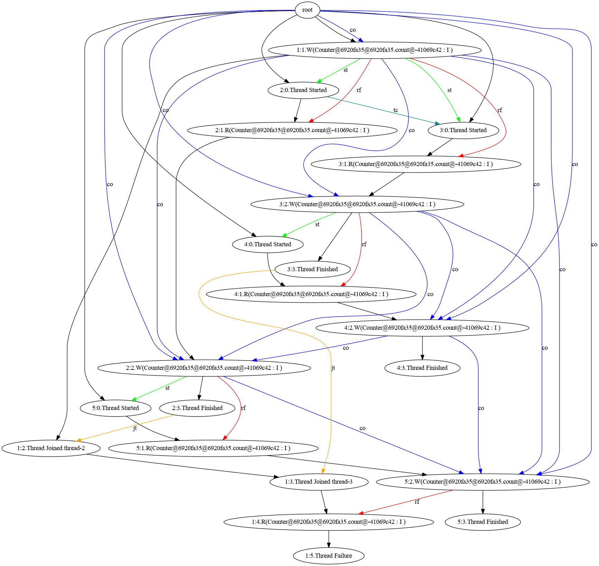
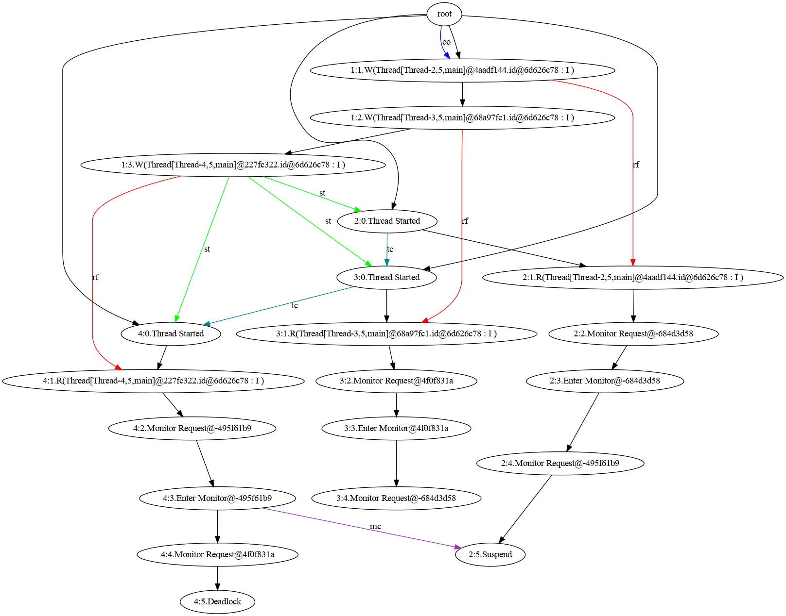

# JMC

The Java Model Checker (JMC) is a tool designed for testing concurrent Java programs. It comes with two main search
strategies to guide the testing process: a random strategy and an optimal DPOR-based stateless model checking strategy
(Trust Strategy). The implementation of DPOR in JMC is based on the Trust algorithm[[1]](#1) with various extensions.
Additionally, JMC includes a replay strategy that can be utilized to replay the execution trace of a concurrent Java
program identified as buggy by JMC.

Please note that this is an early release of the tool for evaluation and all interfaces may change in future versions.

## JMC Capabilities

The current version of JMC is capable of identifying assertion violations and deadlocks that stem from shared resources.

### Detecting Assertion Violations

Within your shared-memory multi-threaded Java program, you can place assertions over shared objects.
When JMC is executed, it will produce various potential execution traces of the program based on the selected search
strategy.
These traces explore different scheduling choices of the threads.
The goal of the exploration is to identify a schedule that violates the assertions.
Upon identifying such a trace, JMC will store it in a file and notify you.
The stored trace can be replayed for debugging.

### Identifying Deadlocks

JMC also keeps track of the acquisition and release of monitors by each thread. In the event of a potential deadlock
within an
execution trace of your program, where one thread is waiting for a monitor held by another thread, and the other thread
is waiting for a monitor held by the first thread, JMC will recognize this deadlock, save the trace as a file, and
notify
you accordingly. The trace can be replayed.

### Debugging

JMC can serve as a tool for debugging concurrent programs. If you have a concurrent Java program that you suspect may
contain an
assertion violation or deadlock, you can use JMC to test your program and identify any problematic execution traces.
Subsequently, you can employ the replay strategy to reenact the execution of the problematic trace and debug your
program.

## Using JMC

The current version of JMC does not include jar files. To use JMC, follow these steps:

1. Clone the repository and open the project in an IDE like IntelliJ IDEA.
2. Build the project.
3. Run predefined tests located in the `src/test/java/org/mpisws/checker/ModelCheckerTest.java` class.

In the `ModelCheckerTest.java` class, each test case is represented as a method for testing a concurrent Java program.
Each test case is annotated with `@Test`, indicating that it is a JUnit test case.

For each test case, follow these steps:

- Create a `TestTarget` object and initialize it with the package name, class name, method name, and the path to the
  Java program you want to test.
- Set your desired configuration for the testing process using the `checker` object, which is an instance of the
  `ModelChecker` class responsible for running the testing process. It contains a `CheckerConfiguration` object for
  setting the configuration parameters for the testing process, including:
    - `int maxIterations`: the maximum number of iterations to run the testing process (default value: `10`).
    - `long seed`: the seed for the random number generator (default value: `new Random().nextLong()`).
    - `StrategyType strategyType`: the strategy to use for the testing process (default value: `StrategyType.RANDOM`).
      You can change it to `StrategyType.TRUST` to use the trust strategy and `StrategyType.REPLAY` to replay the buggy
      trace.
    - `String buggyTracePath`: the path to save and load the buggy trace, used by the random strategy to save the
      potential buggy trace found during the testing process, and by the replay strategy to load and replay the
      execution
      of the buggy trace (default value: `src/main/resources/buggyTrace/`).
    - `String buggyTraceFile`: the name of the file containing the buggy trace (default value: `buggyTrace.obj`).
    - `String executionGraphsPath`: the path to save the .dot and .png files of generated execution graphs during the
      testing process under trust strategy. This field should be ignored when using the random and replay strategies
      (default value: `src/main/resources/Visualized_Graphs/`).

Once the configuration parameters are set, call the `checker.check()` method to initiate the testing process.

## Limitations of JMC

The current version of JMC is an early release, and has many limitations:

- Currently, JMC only accepts the `main` method as the entry point for the program. If your program does not contain a
  main method, you must create one to serve as the entry point for a JMC test.

- Your program must use the Java Thread class to define and create threads exclusively. Thread creation must be
  accomplished by defining classes that extend the `Thread` class. Alternative methods, such as using the `Runnable`
  interface, Thread Factory, or any other means to create threads, are not supported.

- Overriding the `run()` method of the `Thread` class as a lambda expression is prohibited. The `run()` method must be
  defined in the same class that extends the `Thread` class. using lambda expressions to instantiate
  threads is also prohibited.

- Use of features from the `java.util.concurrent` package is not allowed. Only the `Thread` class may be used to create
  threads. Synchronization of threads can be achieved using the `synchronized` block and `join()` method. We also do not
  support
  additional concurrency interfaces such as `Executor`s or `Future`s.
  Using any other features may lead to inaccurate results in the testing process.

- Avoid using spin loops for synchronization purposes.

We expect to handle these features in future releases.

## Running the Project

This project uses Java's `assert` statement, so you need to enable assertions when running the project. If you're using
IntelliJ IDEA, follow these steps:

1. Go to `Run` -> `Edit Configurations...`
2. In the `Configuration` tab, find the `VM options` field.
3. Enter `-ea` in the `VM options` field.
4. Click `Apply` and then `OK`.

Now, when you run the project, assertions will be enabled.
Without these flags, asserts are silently ignored.

## Examples

In this section, we provide two examples of concurrent Java programs run on JMC.
One of them contains a data race over a shared object which leads to an assertion violation.
The other contains a deadlock in using monitors.

### Inconsistent Simple Concurrent Counter

Let's consider a Java program that creates two threads and shares a counter between them. Each thread increments the
counter and then spawns a new helping thread to further increment the counter. The program is outlined below:

```java
public class SimpleCounter extends Thread {

    private final Counter counter;

    public SimpleCounter(Counter count) {
        this.counter = count;
    }

    @Override
    public void run() {
        counter.increment();
        HelpingThread helpingThread = new HelpingThread(counter);
        helpingThread.start();
    }

    public static void main(String[] args) {
        Counter counter = new Counter();
        SimpleCounter thread1 = new SimpleCounter(counter);
        SimpleCounter thread2 = new SimpleCounter(counter);
        thread1.start();
        thread2.start();
        try {
            thread1.join();
            thread2.join();
        } catch (InterruptedException e) {
            e.printStackTrace();
        }
        assert counter.getValue() == 4 : "Counter value is not 4";
        System.out.println("Counter value is 4");
    }
}
```

Where the Counter class is defined as follows:

```java
public class Counter {
    private int count = 0;

    public int getValue() {
        return count;
    }

    public void increment() {
        count++;
    }
}
```

And the HelpingThread class is defined as follows:

```java
public class HelpingThread extends Thread {

    Counter counter;

    HelpingThread(Counter counter) {
        this.counter = counter;
    }

    @Override
    public void run() {
        counter.increment();
    }
}
```

As expected, the counter value should be 4 at the end of the program. Nevertheless, owing to the data race
concerning the `counter` object, the counter value may not reach 4.

This program is located in the `src/main/java/org/mpisws/concurrent/programs/simple/counter/` package. To test this
program using JMC, you can create a test case in the `ModelCheckerTest.java` class as illustrated below:

```java

@Test
@DisplayName("A concurrent counter using nested thread spawning - Random")
void randomTestSimpleCounter() {
    var t = new TestTarget("org.mpisws.concurrent.programs.simple.counter",
            "SimpleCounter",
            "main",
            "src/test/java/org/mpisws/concurrent/programs/simple/counter/"
    );
    System.out.println("SimpleCounter Random Strategy Started");
    checker.configuration.strategyType = StrategyType.RANDOM;
    checker.configuration.buggyTracePath = "src/main/resources/buggyTrace/";
    checker.configuration.buggyTraceFile = "buggyTrace.obj";
    assertTrue(checker.check(t), "SimpleCounter Random Strategy Finished");
}
```

When you execute this test case, you will observe messages in the console detailing how JMC is scheduling the threads
and the outcome of each execution iteration. Since the strategy is configured as RANDOMSTRAREGY, JMC may not identify
the execution trace that violates the assertion. If JMC attempts to check the program multiple times and reaches the
default maximum number of iterations (10 by default) without discovering the buggy trace, it will display a message
indicating that the buggy trace was not found, as shown below:

```
[Runtime Environment Message] : The 10 execution is finished
[Runtime Environment Message] : The maximum number of the executions is reached
[Bytecode Manager Message] : The Halt Execution Exception happened
[Bytecode Manager Message] : The Model Checking process has finished
[Bytecode Manager Message] : The program is thread-safe
```

If you execute the test case multiple times, you may discover that JMC will eventually uncover the buggy trace. In this
particular example, we did not specify a seed for the random number generator, thus JMC will utilize a random seed for
each execution. Once JMC identifies the buggy trace, it will store it in the `src/main/resources/buggyTrace/` directory
under the name `buggyTrace.obj`. Additionally, it will display the trace in the console. An example of a buggy trace
that
JMC may uncover is provided below:

```
[Search Strategy Message] : Execution trace:
[Search Strategy Message] : 1.WriteEvent(tid=1, type=WRITE, serial=1, value=0, loc=Location(clazz=class org.mpisws.concurrent.programs.simple.counter.Counter, instance=org.mpisws.concurrent.programs.simple.counter.Counter@e88e14, field=private int org.mpisws.concurrent.programs.simple.counter.Counter.count, value=0, type=I))
[Search Strategy Message] : 2.StartEvent(type=START, tid=2, serial=0, callerThread=1)
[Search Strategy Message] : 3.ReadEvent(tid=2, type=READ, serial=1, value=0, rf=null, loc=Location(clazz=class org.mpisws.concurrent.programs.simple.counter.Counter, instance=org.mpisws.concurrent.programs.simple.counter.Counter@e88e14, field=private int org.mpisws.concurrent.programs.simple.counter.Counter.count, value=0, type=I))
[Search Strategy Message] : 4.StartEvent(type=START, tid=3, serial=0, callerThread=1)
[Search Strategy Message] : 5.ReadEvent(tid=3, type=READ, serial=1, value=0, rf=null, loc=Location(clazz=class org.mpisws.concurrent.programs.simple.counter.Counter, instance=org.mpisws.concurrent.programs.simple.counter.Counter@e88e14, field=private int org.mpisws.concurrent.programs.simple.counter.Counter.count, value=0, type=I))
[Search Strategy Message] : 6.WriteEvent(tid=2, type=WRITE, serial=2, value=1, loc=Location(clazz=class org.mpisws.concurrent.programs.simple.counter.Counter, instance=org.mpisws.concurrent.programs.simple.counter.Counter@e88e14, field=private int org.mpisws.concurrent.programs.simple.counter.Counter.count, value=0, type=I))
[Search Strategy Message] : 7.WriteEvent(tid=3, type=WRITE, serial=2, value=1, loc=Location(clazz=class org.mpisws.concurrent.programs.simple.counter.Counter, instance=org.mpisws.concurrent.programs.simple.counter.Counter@e88e14, field=private int org.mpisws.concurrent.programs.simple.counter.Counter.count, value=1, type=I))
[Search Strategy Message] : 8.StartEvent(type=START, tid=4, serial=0, callerThread=2)
[Search Strategy Message] : 9.FinishEvent(type=FINISH, tid=2, serial=3)
[Search Strategy Message] : 10.ReadEvent(tid=4, type=READ, serial=1, value=1, rf=null, loc=Location(clazz=class org.mpisws.concurrent.programs.simple.counter.Counter, instance=org.mpisws.concurrent.programs.simple.counter.Counter@e88e14, field=private int org.mpisws.concurrent.programs.simple.counter.Counter.count, value=1, type=I))
[Search Strategy Message] : 11.WriteEvent(tid=4, type=WRITE, serial=2, value=2, loc=Location(clazz=class org.mpisws.concurrent.programs.simple.counter.Counter, instance=org.mpisws.concurrent.programs.simple.counter.Counter@e88e14, field=private int org.mpisws.concurrent.programs.simple.counter.Counter.count, value=1, type=I))
[Search Strategy Message] : 12.FinishEvent(type=FINISH, tid=4, serial=3)
[Search Strategy Message] : 13.JoinEvent(type=JOIN, tid=1, serial=2, joinTid=2)
[Search Strategy Message] : 14.StartEvent(type=START, tid=5, serial=0, callerThread=3)
[Search Strategy Message] : 15.FinishEvent(type=FINISH, tid=3, serial=3)
[Search Strategy Message] : 16.JoinEvent(type=JOIN, tid=1, serial=3, joinTid=3)
[Search Strategy Message] : 17.ReadEvent(tid=1, type=READ, serial=4, value=2, rf=null, loc=Location(clazz=class org.mpisws.concurrent.programs.simple.counter.Counter, instance=org.mpisws.concurrent.programs.simple.counter.Counter@e88e14, field=private int org.mpisws.concurrent.programs.simple.counter.Counter.count, value=2, type=I))
[Search Strategy Message] : 18.FailureEvent(type=FAILURE, tid=1, serial=5)
[Random Strategy Message] : Buggy execution trace is saved in src/main/resources/buggyTrace/buggyTrace.obj
```

Each line of the trace depicts a recorded event, comprising the thread ID, event type, serial number, value, and
location.
For instance, in event 17, the counter value is recorded as 2, which violates the assertion specifying that the counter
value should be 4. The thread with ID 1 is the main thread of the program, the thread with ID 2 is the first spawned
thread, and so on. The `FailureEvent` indicates that the assertion was violated in the execution trace. JMC will store
this trace in the `src/main/resources/buggyTrace/` directory under the name `buggyTrace.obj`. You can now employ the
replay strategy to reenact the buggy trace and debug your program. To do so, you can create a test case in the
`ModelCheckerTest.java` class as demonstrated below:

```java

@Test
@DisplayName("A concurrent counter using nested thread spawning - Replay")
void replayTestSimpleCounter() {
    var t = new TestTarget("org.mpisws.concurrent.programs.simple.counter",
            "SimpleCounter",
            "main",
            "src/test/java/org/mpisws/concurrent/programs/simple/counter/"
    );
    System.out.println("SimpleCounter Replay Strategy Started");
    checker.configuration.strategyType = StrategyType.REPLAY;
    checker.configuration.buggyTracePath = "src/main/resources/buggyTrace/";
    checker.configuration.buggyTraceFile = "buggyTrace.obj";
    assertTrue(checker.check(t), "SimpleCounter Replay Strategy Finished");
}
```

Upon executing this test case, JMC will replay the buggy trace and present the identical execution trace in the console,
as depicted earlier. You can utilize this trace to debug your program and pinpoint the origin of the data race.

Moreover, you can use the Trust strategy to test the program. To do so, you can create a test case in the
`ModelCheckerTest.java` class as demonstrated below:

```java

@Test
@DisplayName("A concurrent counter using nested thread spawning - Trust")
void trustTestSimpleCounter() {
    var t = new TestTarget("org.mpisws.concurrent.programs.simple.counter",
            "SimpleCounter",
            "main",
            "src/test/java/org/mpisws/concurrent/programs/simple/counter/"
    );
    System.out.println("SimpleCounter Trust Strategy Started");
    checker.configuration.strategyType = StrategyType.TRUST;
    checker.configuration.buggyTracePath = "src/main/resources/buggyTrace/";
    checker.configuration.buggyTraceFile = "buggyTrace.obj";
    checker.configuration.executionGraphsPath = "src/main/resources/Visualized_Graphs/";
    assertTrue(checker.check(t), "SimpleCounter Trust Strategy Finished");
}
```

By executing this test case, output messages similar to the random strategy will be displayed in the console.
Additionally, JMC will generate execution graphs, each representing an equivalent class of execution traces. Using the
trust strategy, JMC will generate all possible execution graphs at runtime and execute the program based on these
classes.
If an assertion is violated in any of representative execution trace of the equivalent classes, JMC will store the buggy
trace and return it. If no assertion violation is found in any of the classes, JMC will return a message indicating
that the program is thread-safe.

Since the SimpleCounter class contains a data race on the shared counter object, there exists a buggy trace that
violates the assertion. The trust strategy employed by JMC will eventually identify this buggy trace. One of the
execution
graphs that leads to the assertion violation which is found by JMC for for the SimpleCounter is as follows:



Also, JMC will store the found buggy trace by the trust strategy, and it is possible to replay the buggy trace and debug
the program.

### Dining Philosophers with Deadlock

Let's consider a Java program that simulates the dining philosophers problem. The program creates five philosophers,
each
represented as a thread, and five forks, each represented as a monitor object. Each philosopher first thinks, then
tries to eat by acquiring the right fork and consequently the left fork. After acquiring both forks, the philosopher
eats and then releases
the forks. The program is outlined below:

```java
import java.util.ArrayList;
import java.util.List;

public class DiningPhilosophers {

    public static void main(String[] args) {
        final int NUM_PHILOSOPHERS = 5;

        List<Philosopher> philosophers = new ArrayList<>(NUM_PHILOSOPHERS);
        List<Object> sticks = new ArrayList<>(NUM_PHILOSOPHERS);

        for (int i = 0; i < NUM_PHILOSOPHERS; i++) {
            sticks.add(new Object());
        }

        for (int i = 0; i < NUM_PHILOSOPHERS; i++) {
            Object leftFork = sticks.get(i);
            Object rightFork = sticks.get((i + 1) % NUM_PHILOSOPHERS);
            philosophers.add(new Philosopher(i, leftFork, rightFork));
        }

        for (Philosopher philosopher : philosophers) {
            philosopher.start();
        }

        for (Philosopher philosopher : philosophers) {
            try {
                philosopher.join();
            } catch (InterruptedException e) {
                Thread.currentThread().interrupt();
            }
        }
    }
}
```

Where the Philosopher class is defined as follows:

```java
public class Philosopher extends Thread {
    private final int id;
    private final Object leftStick;
    private final Object rightStick;

    public Philosopher(int id, Object leftFork, Object rightFork) {
        this.id = id;
        this.leftStick = leftFork;
        this.rightStick = rightFork;
    }

    private void think() throws InterruptedException {
        System.out.println("Philosopher " + id + " is thinking.");
    }

    private void tryToEat() throws InterruptedException {
        synchronized (rightStick) {
            synchronized (leftStick) {
                eat();
            }
            System.out.println("Philosopher " + id + " has put down the left stick.");
        }
        System.out.println("Philosopher " + id + " has put down the right stick.");
    }

    private void eat() throws InterruptedException {
        System.out.println("Philosopher " + id + " is eating.");
    }

    @Override
    public void run() {
        try {
            think();
            tryToEat();
        } catch (InterruptedException e) {
            Thread.currentThread().interrupt();
        }
    }
}
```

In this program, there is a subtle scenario that can potentially result in a deadlock. If each philosopher sequentially
picks up the right fork and then waits for the left fork, a deadlock will ensue. In other words, when each philosopher
holds a fork (monitor) and awaits the release of the other fork (monitor) a deadlock will happen. The program can be
found in the `src/main/java/org/mpisws/concurrent/programs/dining/` package. To test this program using JMC, you can
create a test case in the `ModelCheckerTest.java` class as demonstrated below:

```java

@Test
@DisplayName("Dining philosophers problem with deadlock - Random")
void randomTestDiningPhilosophers() {
    var t = new TestTarget("org.mpisws.concurrent.programs.dining",
            "DiningPhilosophers",
            "main",
            "src/test/java/org/mpisws/concurrent/programs/dining/"
    );
    System.out.println("DiningPhilosophers Random Strategy Started");
    checker.configuration.strategyType = StrategyType.RANDOM;
    checker.configuration.buggyTracePath = "src/main/resources/buggyTrace/";
    checker.configuration.buggyTraceFile = "buggyTrace.obj";
    assertTrue(checker.check(t), "DiningPhilosophers Random Strategy Finished");
}
```

Just like the previous example, when you execute this test case, you will observe messages in the console detailing how
JMC is scheduling the threads and the outcome of each execution iteration. Since the strategy is configured as
RANDOMSTRAREGY, JMC may not identify the execution trace that violates the assertion. If JMC attempts to check the
program multiple times and reaches the default maximum number of iterations (10 by default) without discovering the
buggy trace, it will display a message indicating that the buggy trace was not found. A buggy trace that
JMC may uncover is provided below:

```
[Search Strategy Message] : Execution trace:
[Search Strategy Message] : 1.WriteEvent(tid=1, type=WRITE, serial=1, value=0, loc=Location(clazz=class org.mpisws.concurrent.programs.dining.Philosopher, instance=Thread[Thread-2,5,main], field=private final int org.mpisws.concurrent.programs.dining.Philosopher.id, value=0, type=I))
[Search Strategy Message] : 2.WriteEvent(tid=1, type=WRITE, serial=2, value=1, loc=Location(clazz=class org.mpisws.concurrent.programs.dining.Philosopher, instance=Thread[Thread-3,5,main], field=private final int org.mpisws.concurrent.programs.dining.Philosopher.id, value=0, type=I))
[Search Strategy Message] : 3.WriteEvent(tid=1, type=WRITE, serial=3, value=2, loc=Location(clazz=class org.mpisws.concurrent.programs.dining.Philosopher, instance=Thread[Thread-4,5,main], field=private final int org.mpisws.concurrent.programs.dining.Philosopher.id, value=0, type=I))
[Search Strategy Message] : 4.WriteEvent(tid=1, type=WRITE, serial=4, value=3, loc=Location(clazz=class org.mpisws.concurrent.programs.dining.Philosopher, instance=Thread[Thread-5,5,main], field=private final int org.mpisws.concurrent.programs.dining.Philosopher.id, value=0, type=I))
[Search Strategy Message] : 5.WriteEvent(tid=1, type=WRITE, serial=5, value=4, loc=Location(clazz=class org.mpisws.concurrent.programs.dining.Philosopher, instance=Thread[Thread-6,5,main], field=private final int org.mpisws.concurrent.programs.dining.Philosopher.id, value=0, type=I))
[Search Strategy Message] : 6.StartEvent(type=START, tid=2, serial=0, callerThread=1)
[Search Strategy Message] : 7.StartEvent(type=START, tid=3, serial=0, callerThread=1)
[Search Strategy Message] : 8.ReadEvent(tid=3, type=READ, serial=1, value=1, rf=null, loc=Location(clazz=class org.mpisws.concurrent.programs.dining.Philosopher, instance=Thread[Thread-3,5,main], field=private final int org.mpisws.concurrent.programs.dining.Philosopher.id, value=1, type=I))
[Search Strategy Message] : 9.StartEvent(type=START, tid=4, serial=0, callerThread=1)
[Search Strategy Message] : 10.ReadEvent(tid=4, type=READ, serial=1, value=2, rf=null, loc=Location(clazz=class org.mpisws.concurrent.programs.dining.Philosopher, instance=Thread[Thread-4,5,main], field=private final int org.mpisws.concurrent.programs.dining.Philosopher.id, value=2, type=I))
[Search Strategy Message] : 11.MonitorRequestEvent(type=MONITOR_REQUEST, tid=3, serial=2, monitor=Monitor(clazz=class java.lang.Object, instance=java.lang.Object@56263c05))
[Search Strategy Message] : 12.ReadEvent(tid=2, type=READ, serial=1, value=0, rf=null, loc=Location(clazz=class org.mpisws.concurrent.programs.dining.Philosopher, instance=Thread[Thread-2,5,main], field=private final int org.mpisws.concurrent.programs.dining.Philosopher.id, value=0, type=I))
[Search Strategy Message] : 13.StartEvent(type=START, tid=5, serial=0, callerThread=1)
[Search Strategy Message] : 14.StartEvent(type=START, tid=6, serial=0, callerThread=1)
[Search Strategy Message] : 15.MonitorRequestEvent(type=MONITOR_REQUEST, tid=2, serial=2, monitor=Monitor(clazz=class java.lang.Object, instance=java.lang.Object@76efef59))
[Search Strategy Message] : 16.EnterMonitorEvent(tid=3, type=ENTER_MONITOR, serial=3, monitor=Monitor(clazz=class java.lang.Object, instance=java.lang.Object@56263c05))
[Search Strategy Message] : 17.MonitorRequestEvent(type=MONITOR_REQUEST, tid=4, serial=2, monitor=Monitor(clazz=class java.lang.Object, instance=java.lang.Object@60ff5eed))
[Search Strategy Message] : 18.MonitorRequestEvent(type=MONITOR_REQUEST, tid=3, serial=4, monitor=Monitor(clazz=class java.lang.Object, instance=java.lang.Object@76efef59))
[Search Strategy Message] : 19.EnterMonitorEvent(tid=2, type=ENTER_MONITOR, serial=3, monitor=Monitor(clazz=class java.lang.Object, instance=java.lang.Object@76efef59))
[Search Strategy Message] : 20.MonitorRequestEvent(type=MONITOR_REQUEST, tid=2, serial=4, monitor=Monitor(clazz=class java.lang.Object, instance=java.lang.Object@78280ff4))
[Search Strategy Message] : 21.EnterMonitorEvent(tid=4, type=ENTER_MONITOR, serial=3, monitor=Monitor(clazz=class java.lang.Object, instance=java.lang.Object@60ff5eed))
[Search Strategy Message] : 22.MonitorRequestEvent(type=MONITOR_REQUEST, tid=4, serial=4, monitor=Monitor(clazz=class java.lang.Object, instance=java.lang.Object@56263c05))
[Search Strategy Message] : 23.ReadEvent(tid=6, type=READ, serial=1, value=4, rf=null, loc=Location(clazz=class org.mpisws.concurrent.programs.dining.Philosopher, instance=Thread[Thread-6,5,main], field=private final int org.mpisws.concurrent.programs.dining.Philosopher.id, value=4, type=I))
[Search Strategy Message] : 24.ReadEvent(tid=5, type=READ, serial=1, value=3, rf=null, loc=Location(clazz=class org.mpisws.concurrent.programs.dining.Philosopher, instance=Thread[Thread-5,5,main], field=private final int org.mpisws.concurrent.programs.dining.Philosopher.id, value=3, type=I))
[Search Strategy Message] : 25.MonitorRequestEvent(type=MONITOR_REQUEST, tid=5, serial=2, monitor=Monitor(clazz=class java.lang.Object, instance=java.lang.Object@520010a9))
[Search Strategy Message] : 26.MonitorRequestEvent(type=MONITOR_REQUEST, tid=6, serial=2, monitor=Monitor(clazz=class java.lang.Object, instance=java.lang.Object@78280ff4))
[Search Strategy Message] : 27.EnterMonitorEvent(tid=6, type=ENTER_MONITOR, serial=3, monitor=Monitor(clazz=class java.lang.Object, instance=java.lang.Object@78280ff4))
[Search Strategy Message] : 28.EnterMonitorEvent(tid=5, type=ENTER_MONITOR, serial=3, monitor=Monitor(clazz=class java.lang.Object, instance=java.lang.Object@520010a9))
[Search Strategy Message] : 29.MonitorRequestEvent(type=MONITOR_REQUEST, tid=6, serial=4, monitor=Monitor(clazz=class java.lang.Object, instance=java.lang.Object@520010a9))
[Search Strategy Message] : 30.MonitorRequestEvent(type=MONITOR_REQUEST, tid=5, serial=4, monitor=Monitor(clazz=class java.lang.Object, instance=java.lang.Object@60ff5eed))
[Search Strategy Message] : 31.DeadlockEvent(type=DEADLOCK, tid=5, serial=5)
[Random Strategy Message] : Buggy execution trace is saved in src/main/resources/buggyTrace/buggyTrace.obj
```

The trace demonstrates that the program has reached a deadlock. The `DeadlockEvent` indicates that a deadlock has
occurred
in the execution trace. JMC will store this trace in the `src/main/resources/buggyTrace/` directory under the name
`buggyTrace.obj`. You can now utilize the replay strategy to reenact the buggy trace and debug your program. To do so,
you can create a test case in the `ModelCheckerTest.java` class as demonstrated below:

```java

@Test
@DisplayName("Dining philosophers problem with deadlock - Replay")
void replayTestDiningPhilosophers() {
    var t = new TestTarget("org.mpisws.concurrent.programs.dining",
            "DiningPhilosophers",
            "main",
            "src/test/java/org/mpisws/concurrent/programs/dining/"
    );
    System.out.println("DiningPhilosophers Replay Strategy Started");
    checker.configuration.strategyType = StrategyType.REPLAY;
    checker.configuration.buggyTracePath = "src/main/resources/buggyTrace/";
    checker.configuration.buggyTraceFile = "buggyTrace.obj";
    assertTrue(checker.check(t), "DiningPhilosophers Replay Strategy Finished");
}
```

Upon executing this test case, JMC will replay the buggy trace and present the identical execution trace in the console,
as depicted earlier. You can utilize this trace to debug your program and pinpoint the origin of the deadlock.

Finding the deadlock using the Trust strategy is also possible. To do so, you can create a test case in the
`ModelCheckerTest.java` class as demonstrated below:

```java

@Test
@DisplayName("Dining philosophers problem with deadlock - Trust")
void trustTestDiningPhilosophers() {
    var t = new TestTarget("org.mpisws.concurrent.programs.dining",
            "DiningPhilosophers",
            "main",
            "src/test/java/org/mpisws/concurrent/programs/dining/"
    );
    System.out.println("DiningPhilosophers Trust Strategy Started");
    checker.configuration.strategyType = StrategyType.TRUST;
    checker.configuration.buggyTracePath = "src/main/resources/buggyTrace/";
    checker.configuration.buggyTraceFile = "buggyTrace.obj";
    checker.configuration.executionGraphsPath = "src/main/resources/Visualized_Graphs/";
    assertTrue(checker.check(t), "DiningPhilosophers Trust Strategy Finished");
}
```

Using the trust strategy, JMC will generate all possible execution graphs at runtime and execute the program based on
these classes. If a deadlock is found in any of the representative execution traces of the equivalent classes, JMC will
store the buggy trace and return it. If no deadlock is found in any of the classes, JMC will return a message indicating
that the program is deadlock-free.

Since the DiningPhilosophers class contains a deadlock, the trust strategy employed by JMC will eventually identify this
deadlock. One of the execution graphs that leads to the deadlock which is found by JMC for the DiningPhilosophers
with `NUM_PHILOSOPHERS =3`
is as follows:



Indeed, JMC will store the found buggy trace by the trust strategy, and it is possible to replay the buggy trace and
debug the program.

## Contact Us

If you have any questions or find any issues with JMC, or if you would like us to prioritize particular features,
please do not hesitate to contact us at `mkhoshechin@mpi-sws.org`
or `rupak@mpi-sws.org`.

## References

<a id="1">[1]</a>
Kokologiannakis, Michalis, Iason Marmanis, Vladimir Gladstein, and Viktor Vafeiadis.
[Truly stateless, optimal dynamic partial order reduction](https://plv.mpi-sws.org/genmc/popl2022-trust.pdf).
Proceedings of the ACM on Programming Languages 6, no. POPL (2022): 1-28.